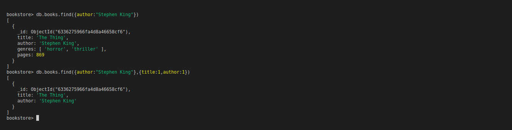
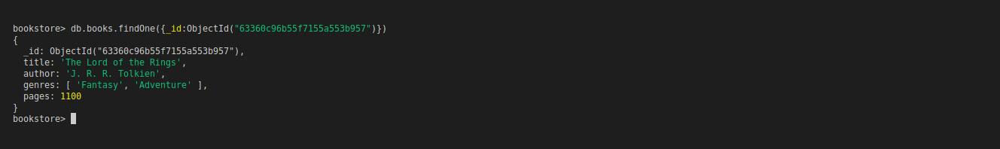

# MongoDB 101: Finding Documents

- `db.<ColectionName>.find()` -> print 20 first documents
- `it` -> iterate through 20 more documents
- `db.<ColectionName>.find({key1:vaue1, key2:vaue2, key3:vaue3})` -> filter documents that satisfy given key-value pairs 

- `db.<ColectionName>.findOne({_id:ObjectId(<IdNumber>)})` -> find document by id

