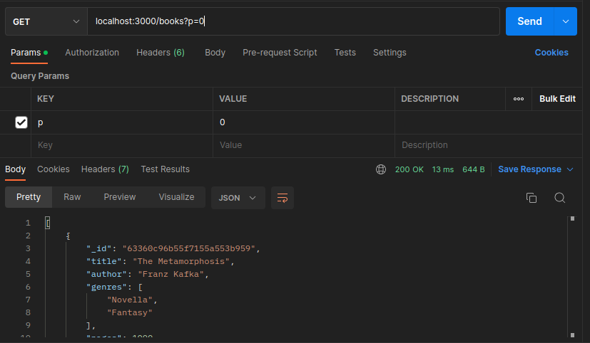
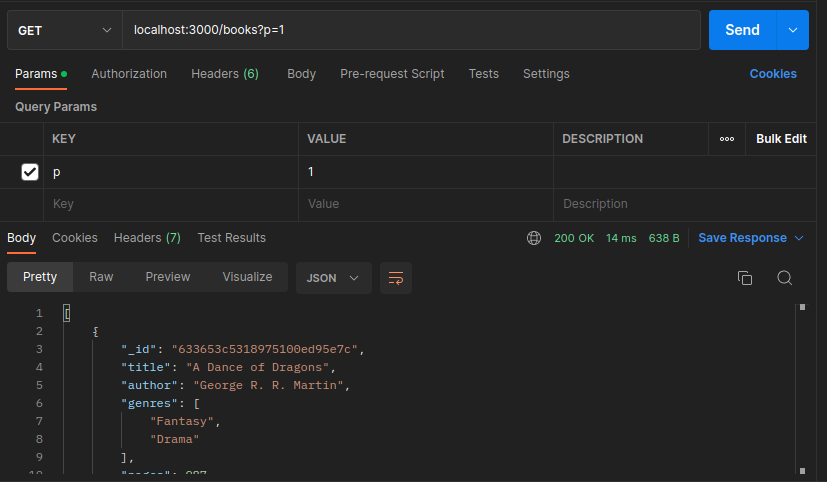

# MongoDB 101: DELETE Requests

#### Handle PATCH request

```
app.get('/books', (req: Request, res: Response) => {
  const page = req.query.p || 0       // ----------* pagination
  const booksPerPage:number = 3       // ----------* pagination
  let books: WithId<Document>[] = []
  db.collection('books')
  .find()
  .sort({ author: 1})
  .skip(booksPerPage*Number(page))    // ----------* pagination
  .limit(booksPerPage)                // ----------* pagination
  .forEach(book=>{
    books.push(book)
  })
  .then(()=>{
    res.status(200).json(books)
  })
  .catch((err)=>{
    console.log(err)
    res.status(500).json(
      {error:"Could not fetch the documents"}
    )
  })
});
```

#### Check

- p=0



- p=1


