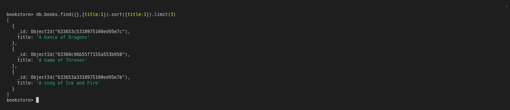

# MongoDB 101: Sorting and limiting data

- `db.<CollectionName>.find({<Key>:<Value>}).count()` -> count filtered documents
- `db.<CollectionName>.find().limit(<Int>)` -> limit output
- `db.<CollectionName>.find().sort({<KEY>:1})` -> sort documents (-1 for inverse order)

