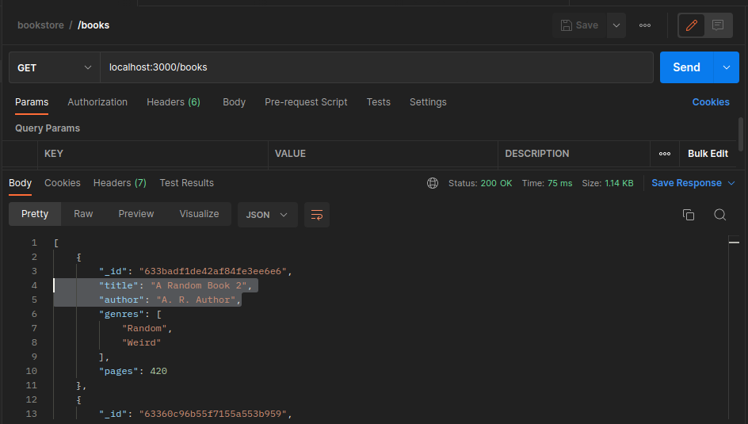
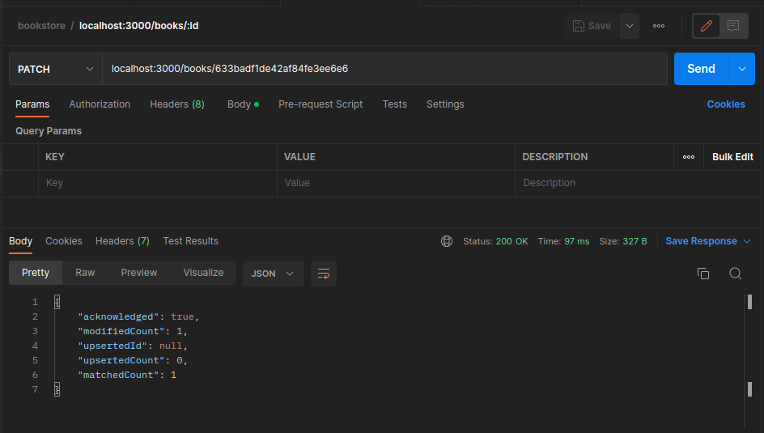
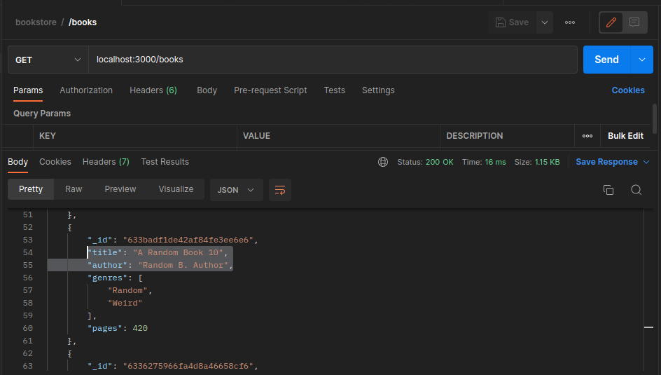

# MongoDB 101: DELETE Requests

#### Handle PATCH request

```
app.patch('/books/:id',(req:Request,res:Response)=>{
  const updates = req.body
  if (ObjectId.isValid(req.params.id)){
    db.collection('books')                            
    .updateOne({_id: new ObjectId(req.params.id)},{
      $set:updates
    })      
    .then(result=>{                                      
      console.log('book updated: ',req.params.id)
      res.status(200)                                 
      .json(result)                                      
    })                                          
    .catch(err=>{
      console.log(err)
      res.status(500).json({error:"Could not update the document"})
    })
  } else {
    res.status(500).json({error:"Invalid id"})
  }
})
```

#### Check

- Pre-patch



- Patch



- Post-patch

