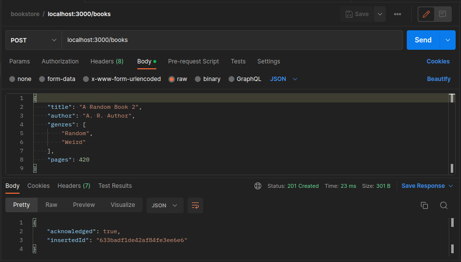
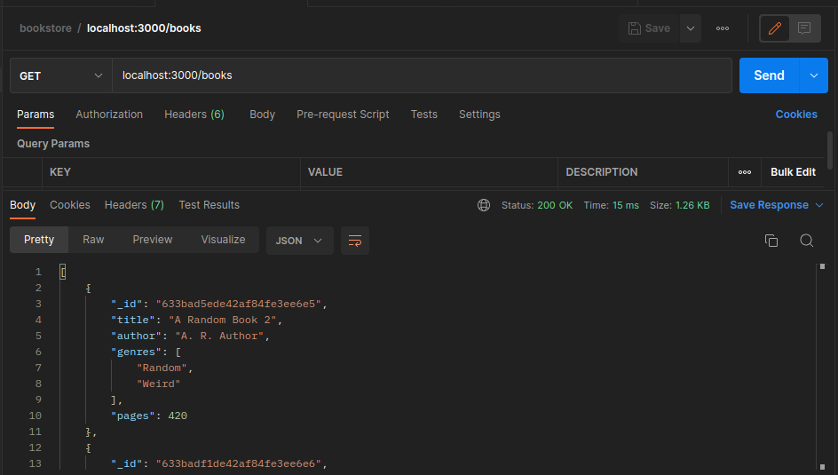

# MongoDB 101: POST Requests

#### Handle POST request

```
app.post('/books',(req:Request,res:Response)=>{
  const book = req.body     // json document
  db.collection('books')
  .insertOne(book)
  .then(document=>{
    console.log('book added')
    res.status(201).json(document)
  })
  .catch(err=>{
    res.status(500).json({error:"Could not create a new document"})
  })
})
```

#### Check

- POST



- GET


